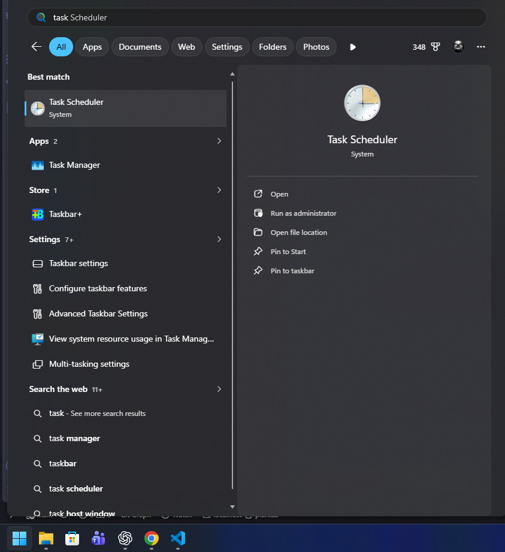
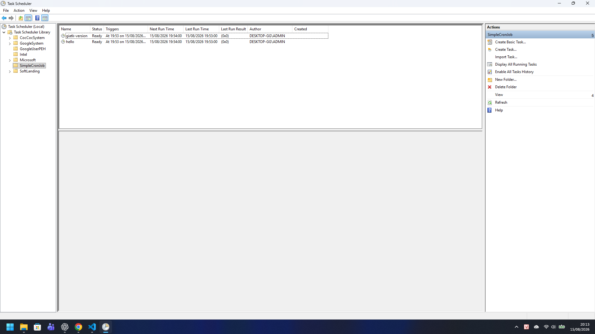

# Simple Cronjob

Simple Cronjob is a TypeScript-based Windows automation tool for running scheduled jobs through Windows Task Scheduler.

A cron job is a regular TypeScript class. You describe its schedule and runtime behavior with the `@CronJob` decorator, then run the application to discover, validate, and reconcile the jobs registered in Windows Task Scheduler.

## Features

- Define jobs as TypeScript classes.
- Use familiar five-field cron expressions.
- Register and reconcile jobs in Windows Task Scheduler.
- Run arbitrary Node.js and CLI automation, including database backups, HTTP calls, notifications, and file operations.
- Support enabled/disabled jobs and filename-based disabling.
- Prevent overlapping executions by default with a process lock.
- Optionally allow parallel executions for a job.
- Configure optional `startAt` and `stopAt` boundaries.
- Write Serilog-style plain-text logs per job and per day.
- Trigger a job manually without waiting for its cron schedule.
- Reuse common command, filesystem, HTTP, environment, and retry utilities.

## Requirements

- Windows with Windows Task Scheduler.
- Node.js 18 or later.
- npm.

## Installation

```powershell
npm install
```

## Creating a Cron Job

Create a new file in `src/cronjobs/` using the `.cronjob.ts` suffix. Each file must export exactly one class decorated with `@CronJob`.

```ts
import { CronJob } from "../core/decorator.js";
import type { CronJobContext, CronJobHandler } from "../core/types.js";

@CronJob({
  description: "Back up the database every 15 minutes.",
  schedule: "*/15 * * * *",
  enabled: true,
  parallel: false,
  startAt: "2026-08-16 09:00:00",
  stopAt: "2026-08-30 18:00:00",
})
export class BackupDatabaseJob implements CronJobHandler {
  async execute(context: CronJobContext): Promise<void> {
    context.logger.info("Database backup started.");
    // Use child_process, a database client, an HTTP client, or any other
    // Node.js-compatible library required by the job.
  }
}
```

The job ID is derived from the filename. For example:

```text
backup-database.cronjob.ts -> backup-database
```

Each job file must contain exactly one `@CronJob` class. The job description and cron expression are validated during discovery.

### Disabling a Job

`enabled` defaults to `true`. Set `enabled: false` to disable a job while keeping it visible to validation and listing commands.

You can also disable a job by prefixing its filename with `_`:

```text
_backup-database.cronjob.ts
```

The job ID remains `backup-database`. When reconciliation runs, the corresponding Task Scheduler task is removed or is not created.

### Preventing Overlapping Runs

`parallel` defaults to `false`. With the default setting, a new execution is skipped while the previous process for the same job is still running.

Set `parallel: true` to allow multiple processes of the same job to run concurrently. Task Scheduler is configured with a parallel multiple-instance policy for that job.

### Start and Stop Boundaries

`startAt` and `stopAt` are optional and use the following local Windows time format:

```text
YYYY-MM-DD HH:mm:ss
```

Before `startAt`, the job does not execute. At or after `stopAt`, the job does not execute and its Task Scheduler task is removed during the next reconciliation or trigger. If both values are specified, `stopAt` must be later than `startAt`.

## Commands

```powershell
# Validate all discovered cron jobs.
npm run validate

# List discovered jobs and their configuration.
npm run list

# Build the project and register jobs in Windows Task Scheduler.
npm run start

# Build the project and trigger one job immediately.
npm run trigger-job -- giatk-version

# Run a compiled job using the application entry point.
node dist/index.js run --job hello

# Trigger a compiled job immediately.
node dist/index.js trigger giatk-version
```

`npm run start` type-checks the project, builds the application, discovers cron jobs, and reconciles tasks with the `SimpleCronJob` prefix in Windows Task Scheduler.

The current scheduler creates a Task Scheduler trigger every minute. The application evaluates the five-field cron expression before executing the job.

The `trigger-job` command bypasses the cron schedule, but it still respects process locking and `parallel`. A job past its `stopAt` value is not executed.

## Windows Task Scheduler

Jobs run under the current logged-on Windows user. The scheduler uses a hidden `wscript.exe` launcher so Node.js jobs can run in the background without opening a console window. The launcher preserves the user context, working directory, and Node.js process exit code.

After adding or changing a cron job, run `npm run start` to reconcile the registered tasks.

### Opening Task Scheduler



### Registered SimpleCronJob Tasks



## Logging

Every job receives a `context.logger`. Logs are written to plain-text files using a Serilog-style format. Scheduled jobs do not write job output to the console.

Example:

```text
[2026-08-15 20:07:03.829] [INFO] Job completed {JobId="hello"}
```

Log files are stored using the following structure:

```text
logs/<job-id>/YYYY-MM/YYYY-MM-DD.log
```

Supported log levels are `trace`, `debug`, `info`, `warn`, `error`, and `fatal`. Timestamps and directory names use the local Windows timezone.

## Shared Utilities

Common utilities are exported from `src/utilities/index.ts`:

```ts
import {
  requestJson,
  retry,
  runCommand,
  writeJson,
} from "../utilities/index.js";

const command = await runCommand("giatk -v");
const response = await retry(
  () => requestJson("https://example.com/health"),
  { maxAttempts: 3, delayMs: 1_000 },
);

await writeJson("tmp/result.json", {
  command,
  status: response.status,
});
```

The current utility set includes:

- `runCommand` and `assertCommandSuccess`
- `retry` and `withTimeout`
- `requestText` and `requestJson`
- `ensureDirectory`, `fileExists`, `readJson`, and `writeJson`
- `getEnv` and `requireEnv`
- `isWindows`

## Cron Expression Syntax

Cron fields use the following order:

```text
minute hour day-of-month month day-of-week
```

The parser supports wildcards (`*`), lists, ranges, and steps. For example:

```text
*/5 12-13 * * 1,3
```

This expression matches every five minutes during hours 12 and 13 on Mondays and Wednesdays.

## Security and Configuration Notes

- Do not hardcode passwords, API keys, or other secrets in job source files.
- Use environment variables or project configuration for secrets.
- Ensure the project and its build output are writable only by trusted users.
- Review command execution and filesystem operations in each job before registering it in Task Scheduler.
